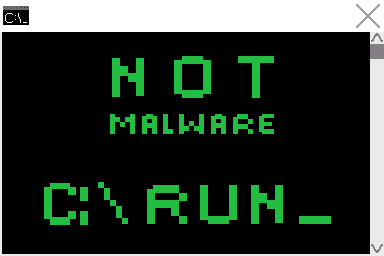

## Hello! 🌱

My name is Allison Lu, and I am a CS Major at Georgia Tech! (If you see floating eyes, try looking in dark mode!)

### Current Work 💻
I am currently a Data & Analytics Intern at Aprio
Currently, I am working on:
- Dangoventure, a game created with Unity, and with Potato Batteries
- Quantum(?) (Name TBD), a multiplayer puzzle game created with Unity
- Paper Planes (VGDev)

### Past art! 🖌️
I also do very simple and basic pixel art!
* For [Gunsnake](https://randomerz.itch.io/gunsnake?secret=4LKq46yjGTfbHatxsqt8vJGBs)
    * 
      
      
      
      
* For [Not Malware](https://rnewton.itch.io/not-malware)
    * 
    * 
      
      
      

### Looking for 🔍
I am currently looking for a summer of 2022 internship!

### 📫 How to reach me:
- email: allison.lu@gatech.edu
- phone: (404) 457-6618
